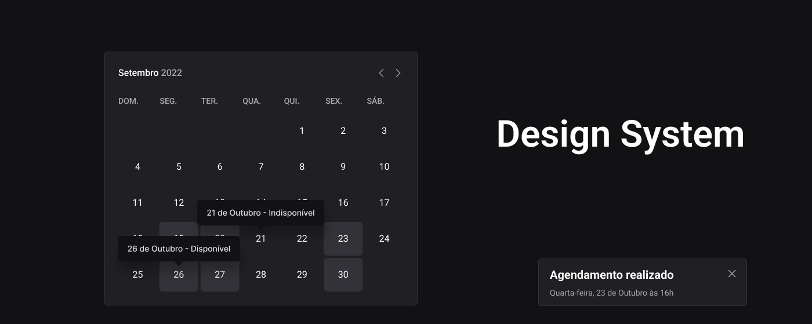

## Design System

Durante este desafio, adicionamos dois componentes (Toast e Tooltip) ao design system que foi desenvolvido durante o módulo 5.

### 🛠️ Nesse projeto foi utilizado

* Storybook
* Stitches
* Radix
* TypeScript